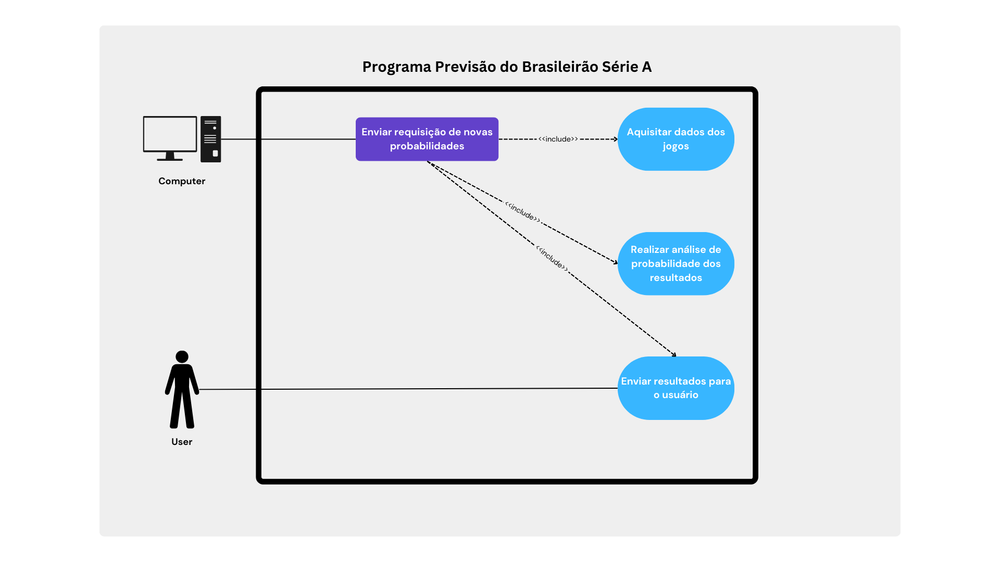
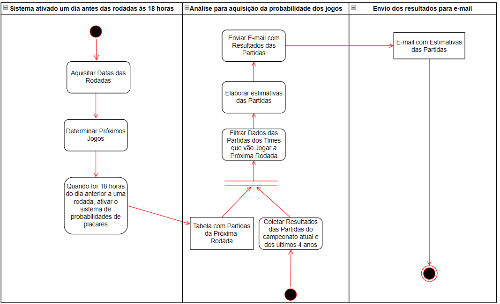

# Programa Previsão do Brasileirão Série A

## Introdução

Este projeto tem como objetivo mostrar todas as etapas do desenvolvimento de um programa que estima jogos para as rodadas do campeonato brasileiro da Série A.

Sendo assim, esse projeto será dividido nas seguintes etapas:

1. Levantamento de requisitos.
2. Desenvolvimento do diagrama de uso de caso.
3. Desenvolvimento do programa e códigos de teste.
4. Deploy do programa.

## Levantamento dos Requisitos

Exsitem diversas formas de ser feito o levantamento de requisitos, e uma delas é respondendo perguntas a fim de levantar e explorar mais informações. Sendo assim, os seguintes questionamentos foram levantados e respondidos.

1. Qual é o objetivo principal do programa?

   - Receber estimativas de placares das rodadas do campeonato brasileiro da série A.

2. Como as estimativas devem ser enviadas para o usuário?

   - Através de um e-mail.

3. Qual a frequência que as estimativas devem ser enviadas?

   - Um dia antes às 18 horas de cadas rodada.

4. Existe alguma taxa de acerto mínima?

   - Não inicialmente. Porém, é possível revisar esse ponto em uma segunda etapa desse projeto.

5. Deve ser utilizado dados dos anos anteriores?
   - Sim. Deve ser considerado até 5 anos antes.

## Diagrama do Usuário

Baseado nas respostas do levantamento de requisitos, é possível elaborar o seguinte diagrama do usuário.

### Detalhamento dos Cenários

Cenário Principal:

1. Sistema ativado um dia antes das rodadas às 18 horas.
2. Programa aquisita os dados atualizados das rodadas. << include >>
3. Realizar análise para aquisição da probabilidade dos jogos. << include >>
4. Enviar resultados para e-mail cadastrado. << include >>

Cenário Alternativo:

- Não acontecerá jogos na data estimada.
  - Não enviar e-mail com resultados.
- Não ser possível enviar o e-mail, pois o e-mail não é válido.
  - Enviar e-mail do gerenciador do sistema informando que não foi possível enviar as probabilidades para o e-mail determinado.

## Diagrama de Atividade

Os diagramas de atilidade são criados a fim de detalhar as etapas que serão criadas através dos códigos. Sendo assim, o seguinte diagrama é criado a partir dos cenários:

