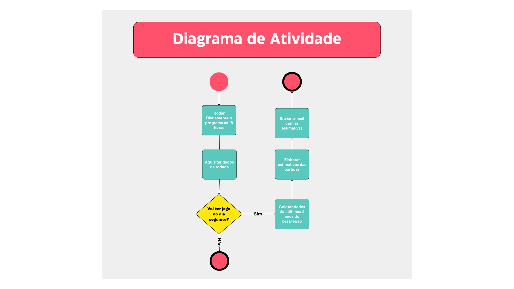

# Programa Previsão do Brasileirão Série A


## Introdução

Este projeto tem como objetivo mostrar todas as etapas do desenvolvimento de um programa que estima jogos para as rodadas do campeonato brasileiro da Série A, e envia os resultados periodicamente por e-mail para o usuário.

Sendo assim, esse projeto será dividido nas seguintes etapas:

1. Levantamento de requisitos.
2. Desenvolvimento do diagrama de uso de caso.
3. Desenvolvimento do diagrama de atividade.
4. Desenvolvimento dos códigos do programa
5. Desenvolvumento dos códigos de teste do programa.
6. Deploy do programa.

## Levantamento dos Requisitos

Exsitem diversas formas de ser feito o levantamento de requisitos, e uma delas é respondendo perguntas a fim de juntar e explorar mais informações. Com isso, as seguintes perguntas foram feitas e respondidas.

1. Qual é o objetivo principal do programa?

   - Receber estimativas de placares das rodadas do campeonato brasileiro da série A.

2. Como as estimativas devem ser enviadas para o usuário?

   - Através de um e-mail.

3. Qual a frequência que as estimativas devem ser enviadas?

   - Um dia antes às 18 horas de cadas rodada.

4. Existe alguma taxa de acerto mínima?

   - Não inicialmente. Porém, é possível revisar esse ponto em uma segunda etapa desse projeto.

5. Deve ser utilizado dados dos anos anteriores?
   - Sim. Deve ser considerado até 5 anos antes.

## Diagrama do Usuário

Baseado nas respostas do levantamento de requisitos, é possível elaborar o seguinte diagrama do usuário.


### Detalhamento dos Cenários

Cenário Principal:

1. Sistema ativado um dia antes das rodadas às 18 horas.
2. Programa aquisita os dados atualizados das rodadas. << include >>
3. Realizar análise para aquisição da probabilidade dos jogos. << include >>
4. Enviar resultados para e-mail cadastrado. << include >>

Cenário Alternativo:

- Não acontecerá jogos na data estimada.
  - Não enviar e-mail com resultados.
- Não ser possível enviar o e-mail, pois o e-mail não é válido.
  - Enviar e-mail do gerenciador do sistema informando que não foi possível enviar as probabilidades para o e-mail determinado.

## Diagrama de Atividade

Os diagramas de atividade são criados com o intuito de detalhar as etapas que serão criadas através dos códigos. Consequentemente, o seguinte diagrama foi criado a partir dos cenários:



## Criação do Código - Verificação Diária às 18 Horas 

Apesar de somente ser necessário enviar as estimativas dos jogos um dia antes das partidas, é necessário fazer uma verificação diária para ver se irá ocorrer jogos no dia posterior ou não, como visto no diagrama de atividade. Existem diversas formas de executar essa parte do programa e a mesma deve ser definida pelo usuário, pois cada uma tem vantagens e desvantagens. De qualquer forma, abaixo é possível encontrar algumas opções de como essa etapa poderia ser feita:
* Windows task scheduler + Computador Pessoal - Para os usuários do Windows é possível utilizar a ferramenta "task scheduler" que irá executar o programa no horário desejado.
    * Vantagens:
        * Fácil configuração.
        * Não exige pagamento.
    * Desvantagens:
        * Necessário ter o computar ligado no horário que está programado para que o arquivo seja executado, senão não é possível rodar o código. 
        * Ocupa memória do computador utilizado quando o programa está rodando. 

* Windows task scheduler + Máquina dedicada - É possível utilizar o "Task Scheduler" em uma máquina dedicada como um computador mais antigo ou um Raspberry Pi.
    * Vantagens:
        * Fácil configuração.
        * Não exige pagamento.
    * Desvantagens:
        * Necessário ter o computar ligado no horário que está programado para que o arquivo seja executado, senão não é possível rodar o código. 
        * Necessário ter um segundo equipamento dedicado ao programa, o que exige custo, energia e espaço.

* Github Actions - É possível utilizar o Github Actions para rodar códigos em horas programadas (com uma certa limitação de precisão).
    * Vantagens:
        * Código e sistema de automação em um só local.
        * Não exige pagamento.
    * Desvantagens:
        * A conta free tem uma limitação de tempo de execução, ou seja, dependendo da aplicação não será possível utilizar essa opção.
        * O Github actions é utilizado para diversos processos dentro do Github, então rodar a automação nele pode limitar o uso dos seus recursos.  
     
* VPS ou Sistemas de Nuvem - É possível utilizar uma VPS ou um sistema de nuvem para rodar códigos em horas programadas.
    * Vantagens:
        * Auto nível de automação. Exige o mínimo de acompanhamento uma vez feita a configuração.
    * Desvantagens:
        * Necessário pagamento do recurso utilizado. 
        * Não é tão simples de configurar. 

* Acionamento diário do usuário - Também é possível que o usuário execute o programa nos horários desejado.
    * Vantagens:
        * Não exige pagamento.
        * Não exige configuração extra.
    * Desvantagens:
        * Necessário disciplina do usuário para fazer rodar o programa nos dias desejados.  
        * Ocupa memória do computador utilizado quando o programa está rodando. 

## Criação do Código - Aquisição dos Dados da Rodada 

A primeira parte do código exige que as datas das partidas sejam aquisitadas. Sendo assim, é utilizado o seguinte código para poder fazer o web scraping do site do globo.com:

```python


```